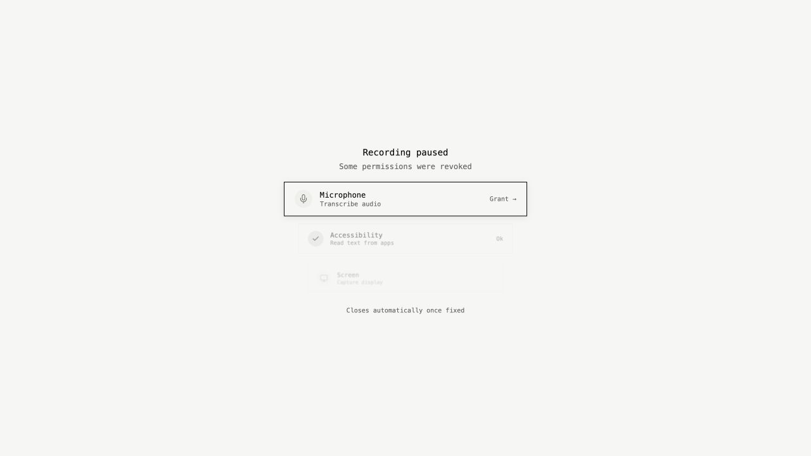
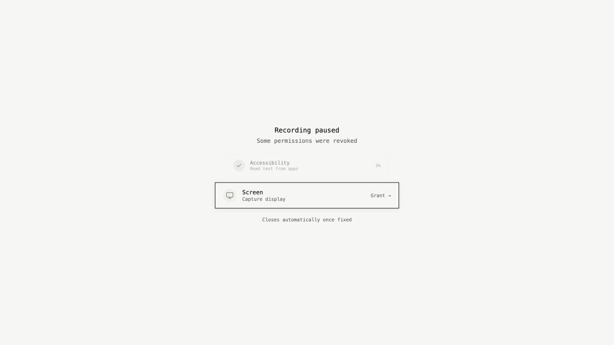
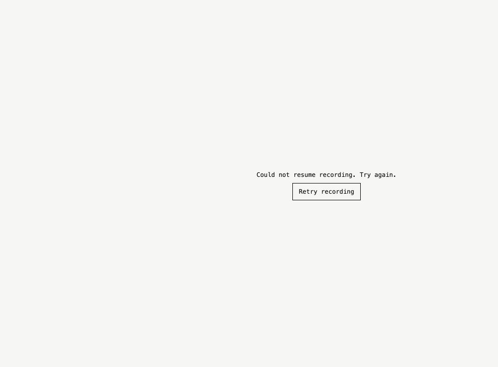

# Permission recovery component evidence

These browser screenshots render the real permission-recovery React component with synthetic Tauri and settings responses. They are component previews, not captures of a running native Screenpipe app.

- Before: recreated baseline from `94fe43628115f9039d4ea86af7c257fc3d61918e`.
- After: the component in this change.
- Both: 1280 × 720, light theme, audio disabled, microphone denied, accessibility granted, screen recording denied, keychain enabled.

Before, the microphone row blocked screen recovery. After, the screen grant is actionable and the unused microphone row is omitted. With audio enabled, microphone recovery still appears (checked in the same preview and covered by component tests).

These images do not verify macOS screenshot or screen-sharing behavior. That requires a native build without the E2E capture-protection bypass, followed by screenshots with the permission-recovery window open. The production change removes the window-specific `NSWindowSharingNone` override and retains the regular-window capture policy.

## Retry failure preview

The updated component with audio disabled and screen/accessibility granted, after a synthetic native retry error. Recovery stays open and offers an explicit retry instead of claiming recording resumed. This is also a browser component preview.

