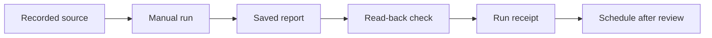

A scheduled report is useful when the right source is available, the run completes, and the result arrives where you expect. Check all three before relying on it for a daily brief, client log, or task database.

This guide builds a local draft first. Writing to a connected app adds a separate delivery step and permission check.

## Define the report

Fill in this small setup card before creating a pipe:

```text
Name: daily-project-report
Purpose: show what changed and what needs attention on one project
Source: [project], [apps], [date range and timezone]
Output: [private folder]/[date]-project-report.md
First run: manual, using a known recorded work period
Future schedule: choose after the manual result is useful
Success: file exists, claims have evidence, corrections are preserved
No-data behavior: write a coverage note, never invent completed work
External actions: none
```

## Create the manual version

In **Pipes → My Pipes → create your own pipe**, paste the prompt below. Replace the bracketed fields. Review the generated configuration and keep auto-run off for the first test.

```text
Create a Screenpipe pipe named [name] for [project]. Check for an existing
equivalent first and show its configuration before updating it.

For [local date or explicit interval and timezone], query bounded screenpipe
history and write a Markdown report to [private folder]. Include verified
changes, decisions, open loops, blockers, source timestamps, and coverage
gaps. Use activity-summary if numeric active-time totals are needed.

Use a stable report key from project + source interval. Preserve reviewed
corrections. Rerunning the same interval must not append duplicate tasks.
If evidence is absent, write NO_DATA with the queried interval and filters.
If a required connection fails, write BLOCKED with the failed step. Do not
describe either case as a successful report or as zero work performed.

After saving, read the file back. Write a separate run receipt containing
source interval, completion time, output path, report status, known gaps,
and the next step if blocked. Never include credentials in the receipt.
Keep the first run manual. Do not send messages or update external systems.
```

The status names in this prompt are a suggested report format you define. They do not add new built-in task statuses or guarantee that an AI follows the instructions. Verify the generated files and execution history.

## Check the complete path



| Check | Evidence of success |
| --- | --- |
| Source | The timeline contains the expected task and interval. |
| Execution | The run finishes and its log has no unresolved error. |
| Content | A few important claims match their source moments. |
| Delivery | The exact destination file or page can be reopened. |
| Rerun | The same source window produces one report without duplicate entries. |
| Empty window | A known empty interval produces a coverage note, not invented work. |

An agent that cannot start, crashes, or loses file access may never write its receipt. A missing or stale receipt is therefore an unresolved run, even if no error notification arrived. Check task history when the expected report is absent.

## Example receipt

This fictional receipt describes a partial draft that needs review:

```yaml
report_key: example-project-2026-09-01
source_window: "2026-09-01 09:00–17:00 America/New_York"
completed_at: "2026-09-01T17:05:00-04:00"
status: PARTIAL
output: "reports/2026-09-01-example-project.md"
verified: "file reopened after save"
gaps:
  - "No transcript available for the 15:00 call"
next_step: "Review the call separately before using its decisions"
```

## Add one destination at a time

For Notion or another task database, verify its [connection](/connections) and exact destination before enabling writes. First prepare the proposed rows locally:

```text
Prepare a preview of the entries this report would add to [destination].
Show field mappings, stable source IDs, proposed updates, and duplicates to
skip. Preserve completed status and human corrections. Ask me to review the
preview before writing. After an approved write, read the destination back
and record its page or row ID in the receipt. If verification fails, mark
delivery unverified and inspect the destination before retrying.
```

This avoids retrying a successful write merely because its response was lost. A connected badge alone does not prove a report reached the correct database.

## Enable and maintain the schedule

After the manual and rerun checks pass, choose the frequency and timezone in the task configuration. Verify the displayed schedule, then enable auto-run. Keep the computer and the required Screenpipe runtime available for a local task; do not assume missed runs will be backfilled.

Review the first scheduled result and its receipt. If it fails, turn auto-run off while repairing the failing step. Use [AI usage and controls](/ai-usage-and-controls) to stop an active run and understand usage.

| Symptom | Inspect next |
| --- | --- |
| No run in history | Enabled state, schedule, timezone, and runtime availability |
| Run failed before searching | Provider authentication, allowance, or startup error |
| Empty report | Source interval, filters, capture, and pending transcription |
| Report exists, destination unchanged | Connection, permissions, field mapping, and delivery receipt |
| Duplicate tasks | Stable IDs and destination read-back before retries |
| Stale report with no warning | Last successful receipt and subsequent execution logs |

For endpoint, authentication, or permission errors, continue with [pipe debugging](/pipe-debugging).
