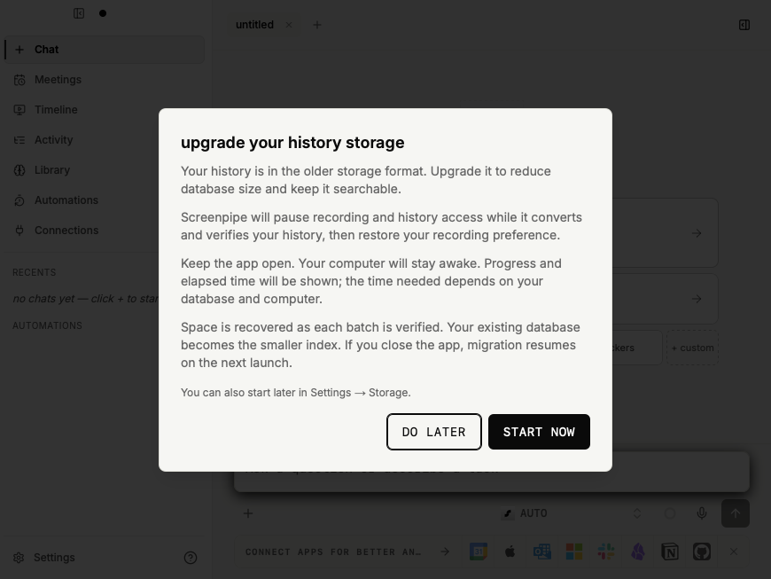
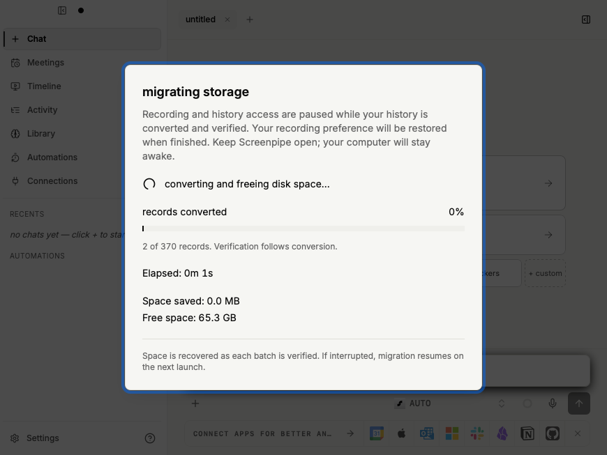
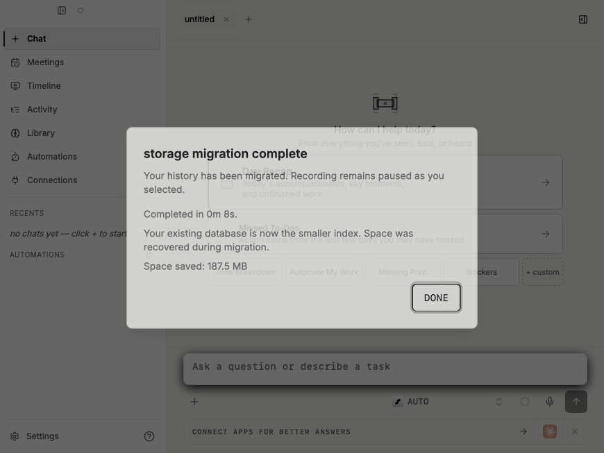
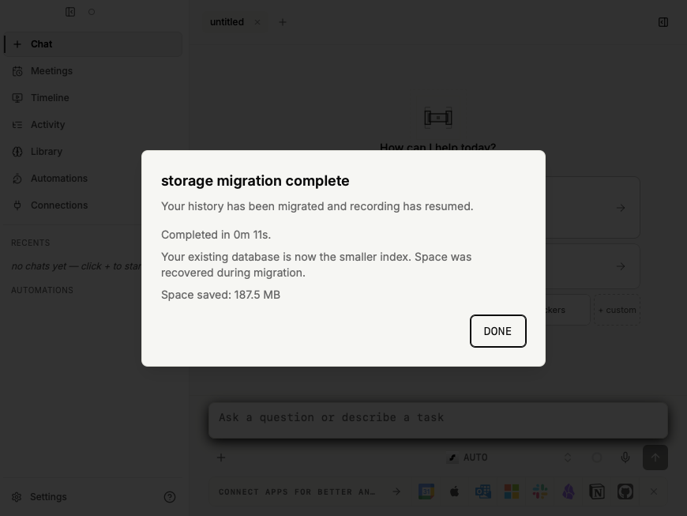
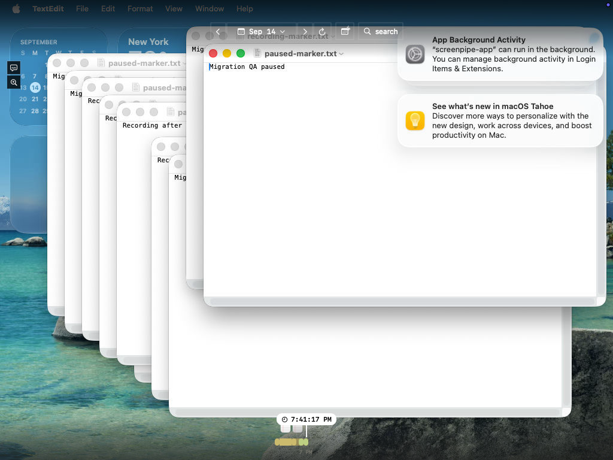

# In-place storage migration acceptance

<!-- doc-covers: crates/screenpipe-db/src/storage, crates/screenpipe-db/tests/in_place_migration.rs, apps/screenpipe-app-tauri/src-tauri/src/storage_migration.rs -->
<!-- doc-verified: fa6f6dca784b6fd60ed0cab4431e561ebd65d681 -->

The scoped acceptance checks passed: macOS native pause/restart/resume/completion, storage suites, actual APFS/NTFS/ext4 reclamation, exhausted-space recovery, and the larger capacity run with production defaults. Exact revisions and remaining evidence limits are recorded below.

The comparison starts at `69a44548c1b053ec762903b5155f5a1e859cf226` (PR #7000's previous head). Production migration still uses a 16 MiB batch target and 2 GiB reserve. The 256 MiB filesystem fixtures reduce limits; a separate 8 GiB ext4 run retains both production defaults.

## Physical capacity

The real-schema fixture inserts 96 frames and 96 elements with incompressible content, then fills a disposable small filesystem with unrelated data (256 MiB APFS/ext4; NTFS VHD below 512 MiB). Each migration verifies logical data and observes positive space recovery before the final batch. No second database or complete elements-table copy is created.

All sizes below are bytes; allocation measurements include the SQLite index, Parquet files and temporary files present under the generation. The Parquet column reports summed file lengths; before/after storage and free-space columns are physical measurements. Logical file lengths remain separate integrity inputs.

| Filesystem | Initial free | Final Parquet file bytes | Allocated before | Allocated after | Remaining free | Result |
| --- | ---: | ---: | ---: | ---: | ---: | --- |
| APFS | 13,176,832 | 38,406,656 | 51,302,400 | 43,483,136 | 20,770,816 | PASS |
| Linux ext4 | 13,262,848 | 38,406,656 | 51,335,168 | 42,983,424 | 21,139,456 | PASS |
| Linux ext4, production defaults | 2,281,324,544 | 3,225,879,170 | 4,302,118,912 | 3,356,508,160 | 3,226,308,608 | PASS |
| Windows NTFS | 12,693,504 | 38,406,656 | 51,339,264 | 43,393,520 | 20,312,064 | PASS |

APFS, ext4 and NTFS also passed actual disk exhaustion followed by resume, preserving every committed Parquet file. The final NTFS physical checks passed at `fa6f6dca784b6fd60ed0cab4431e561ebd65d681` on a 486,469,632-byte NTFS volume. A FAT volume rejected migration during preflight without creating a journal or changing the source. Fragmented free pages were tested by reopening SQLite and comparing live payloads after reclamation; the helper preserved the file's logical length and integrity.

Commands from the repository root:

```sh
cargo test -p screenpipe-db --test hybrid_storage --test in_place_migration --test bulk_storage --test storage_snapshots --test sqlite_architecture_invariants_test --features storage-fault-injection -- --nocapture
cargo test -p screenpipe-db --lib storage:: --features storage-fault-injection -- --nocapture
# Final construction-ownership check, including in-memory startup compatibility:
cargo test -p screenpipe-db --test in_place_migration --test hybrid_storage --test bulk_storage --test storage_snapshots --test sqlite_architecture_invariants_test --test db_config_test --features storage-fault-injection -- --nocapture
```

The five integration suites plus database configuration passed 41 tests on macOS at `fa6f6dca784b6fd60ed0cab4431e561ebd65d681`, and all 13 storage unit tests passed. The bounded-streaming fixture passed again after its final explicit checkpoint correction. APFS constrained migration and exhaustion/resume both passed at `c1f38e0d3d38ccd5480e323ed079a1c51e342131` (28.41 seconds). Linux passed bulk/hybrid at `909f6b8ac9354798bc9b597bdda2c3e8e2a77bc7`, then in-place/snapshot/architecture at `f8fee782e8f2e77e517ded7499e2ef2c8905e6d9`; the intervening change checkpoints the test fixture before measuring its source allocation. Reclamation passed on both platforms. After the Windows flush-handle correction at `ce34a109d6e4ac3e78f8b5a784ac209bc8e90fb0`, macOS reran bulk/hybrid/in-place (31 passed) and Linux reran hybrid/snapshot (19 passed). The three ignored filesystem tests were run separately on their required disposable volumes:

```sh
# APFS + FAT: owned hdiutil volumes, with .screenpipe-disposable-volume markers.
SCREENPIPE_CONSTRAINED_VOLUME="$APFS_VOLUME" SCREENPIPE_UNSUPPORTED_VOLUME="$FAT_VOLUME" cargo test -p screenpipe-db --test in_place_migration --features storage-fault-injection -- --ignored --test-threads=1 --nocapture
# Linux: owned 256 MiB ext4 loop filesystem, marked and mounted at this path.
SCREENPIPE_CONSTRAINED_VOLUME=/home/admin/migration-volume cargo test -p screenpipe-db --test in_place_migration --features storage-fault-injection -- --ignored --skip unsupported_volume_fails_before_conversion --test-threads=1 --nocapture
```

The production-default run uses 4,096 frames and 4,096 elements on an owned 8 GiB ext4 filesystem. Its filler leaves roughly 2 GiB plus 128 MiB free, and the final Parquet allocation must exceed that initial free space:

```sh
SCREENPIPE_TEST_MIGRATION_DEFAULTS=1 SCREENPIPE_CONSTRAINED_VOLUME=/home/admin/migration-defaults cargo test -p screenpipe-db --test in_place_migration migration_completes_with_less_free_space_than_its_final_payloads --features storage-fault-injection -- --ignored --exact --nocapture
```

The production-default run passed in 933.66 seconds at `7af2ee25b41cb63c8f3ce7f60ce7ef4c21b9af59`. It recovered space during conversion and verified all 8,192 records. An earlier attempt filled the volume while constructing the source fixture because its WAL was not bounded; migration preflight safely rejected it. The fixture now checkpoints every 128 inserted rows. This changes only fixture construction, not migration limits.

## Recovery and compatibility

The scoped suites cover interruption before/after rename, transactional schema checkpoints, batch staging, file reservation/flush, publication before/after commit, reclamation, descriptor publication and completed activation. Later-hit interruptions compare already published Parquet files byte for byte after resume. Normal startup remains blocked while the conversion journal is pending.

Other passing cases cover external readers, insufficient headroom, failed payload writes, privacy-ineligible resident payloads, mutable unfinished records, logical IDs/values/relationships/search, upload identity, compact backup/restore, and export/reimport. Completed legacy migrations retain their original-copy deletion flow. An unfinished legacy candidate can be retired only after verifying its complete source; missing receipts fail closed.

## Desktop and interfaces

Commands from `apps/screenpipe-app-tauri`:

```sh
NODE_OPTIONS=--no-experimental-webstorage bun run test:vitest components/storage-migration-prompt.test.tsx components/storage-migration-gate.test.tsx components/settings/storage-migration-card.test.tsx
bun run typecheck
bun run test:tauri tauri_bindings_are_current -- --nocapture
# After merging the concurrent app-process reminder change:
bun run bindings:generate
bun run bindings:check
bun run coverage:core
bun ../../docs/coverage/scripts/generate-unified-coverage-report.ts
bun run coverage:all:check
bun run build:tauri:e2e
```

UI: 24 tests passed after merging the concurrent app-process reminder fix `9f6567b64d12b35de63854be383b90114a88850b`. Typecheck, generated binding check, and E2E/core/unified coverage freshness passed. After the reminder merge, both queued binding generation and the separate current-binding check passed (1 test each). `cargo fmt -p screenpipe-db -- --check`, focused native migration/recording formatting and `git diff --check` passed. Coverage maps include the reclamation helper, bounded checkpoint reader test and in-place migration scenarios; generated core and unified reports are updated.

Native acceptance uses a fresh disposable Orchard Mac cloned from the verified SIP-disabled Tahoe base, 6 CPUs/16 GiB RAM and over 20 GiB free. The bundle is built locally through the native build queue, privately transferred with matching SHA-256 and granted permissions with the repository's `tcc-grant` tool. The queue's E2E command is temporarily changed from `--no-bundle` to `--bundles app` for packaging and restored afterward. No unqueued native build is used.

The feature-only harness uses the supported E2E account/onboarding seed and disables audio; account authentication and audio recording are outside these checks. It captures a unique TextEdit marker, adds bounded legacy payload fixtures while the app is stopped, then starts migration using the visible button. It asserts capture and the history API are stopped during conversion. One case force-quits after a committed batch and verifies automatic resume preserves that file's hash and the user's pause preference. The other verifies automatic recording resumption. Both verify the original captured text, search all 128 inserted history frames, record a subsequent real frame and display the marker in Timeline.

Native acceptance at `754f1fd0cbb81f2c663c5a106dbbc7d037852f09` passed both recording states, including positive measured savings/free space in the completion event and elapsed time preserved through reopen. The transferred bundle SHA-256 is `a033c4336730e25880d953f56a64b23a7a5efd31adc2423ddbdc045db8fb6460`. Test-only fixture changes followed this build. The later flush correction changes handle access on Windows; Unix continues to open the completed files for reading before fsync. Merge `6b2d81e606fc503c3f74d2b3a35a9383dbb0fb25` incorporates only the concurrent app-process reminder field, UI persistence and tests; migration activation is unchanged. UI/type/binding checks cover that integration. Subsequent database corrections use literal SQLx filename options, wait within the existing busy timeout for finishing checkpoint readers, and defer reader connections during fresh hybrid construction; scoped database and physical-filesystem tests cover these changes. The complete desktop binary was not rerun after those corrections.

The native harness command was `python3 /Users/admin/migration-acceptance.py` inside the disposable Mac. Its script and JSON receipts are retained with the evidence. The final VNC capture samples the real guest display roughly every 10 seconds; screenshots and receipts provide the exact completion values. The native Timeline uses a separate compositor layer, so its evidence is a guest-display capture, not a WebDriver webview snapshot.







A native Win32 probe on the disposable Windows VM confirmed `FlushFileBuffers` fails with error 5 for both file and directory handles opened only for reading, and succeeds with write access. Storage now uses a shared file-sync helper and opens the Windows directory handle with write access. The publication sequence is unchanged. The initial Windows run at `909f6b8ac9354798bc9b597bdda2c3e8e2a77bc7` passed the reclamation test but failed all eight bulk tests: read-only flush handles returned error 5, and SQLx interpreted the question mark in canonical Windows paths as a URL query. Revision `c275a3532fb15c24b6da74ddaa5bf492122289f5` opens disk files through SQLx filename options while preserving existing in-memory URI handling. Mac reran the five storage suites plus database configuration (41 passed), including backup/restore and export/remigration under paths containing a literal question mark. The second Windows run at `c275a3532fb15c24b6da74ddaa5bf492122289f5` passed bulk storage, backup/restore, export/reimport and NTFS constrained migration. It exposed a finishing-reader race during schema construction and two fixture assumptions. Construction now requests a [FULL checkpoint](https://www.sqlite.org/pragma.html#pragma_wal_checkpoint), which uses SQLite's existing busy timeout, and still rejects an incomplete checkpoint. A regression pins a snapshot until timeout, then confirms a finishing reader can release successfully; no restart or retry framework was added. The next Windows run still encountered incomplete checkpoints during fresh hybrid construction. Unpublished generation construction now keeps exactly one writer connection and defers read-pool connections until the schema is complete. The published generation reopens with its normal pool configuration. Checkpoint failures include the busy/page counts for diagnosis.

The bounded-streaming fixture now checkpoints before measuring its source file and measures its own peak allocation instead of setting a budget relative to changing host-wide free space. The NTFS exhaustion fixture truncates and flushes its owned filler before deleting it, because deletion alone had returned before its allocation became available. The app correctly refused to resume while only 364,544 bytes were free. Real constrained-volume tests remain the disk-capacity evidence.

Three existing unit fixtures still expected the older element-record cache path after `a9aa6aced6` promoted frame selection. They now target the active frame decode hook, wait for their cancelled decode to finish before asserting released permits, and exercise actual privacy revocations. Production reader behavior is unchanged. All 13 storage unit tests and all 41 Mac integration/configuration tests passed after these corrections. At `c1f38e0d3d38ccd5480e323ed079a1c51e342131`, both NTFS physical checks passed, while several fresh-initialization tests still failed. At `fa6f6dca784b6fd60ed0cab4431e561ebd65d681`, all 13 Windows storage unit tests, all 34 applicable integration cases in one combined command, and both NTFS volume tests passed (each Cargo command exited 0). This includes every previously failing initialization case. The worktree remained clean. VHD provisioning first tried the unavailable `New-VHD` cmdlet and exited 1 before creating a disk; the built-in `diskpart` workflow then succeeded. Both attempts are retained in the evidence.

The Windows runs use the immutable prepared dev image `2026.8.26` on an isolated two-core Spot VM. The guest uses the image's MSVC/Rust cache with one Cargo build job. Commands from `C:\src\screenpipe`:

```powershell
$env:CARGO_BUILD_JOBS='1'
cargo test -p screenpipe-db --lib storage:: --features storage-fault-injection -- --nocapture
cargo test -p screenpipe-db --test in_place_migration --test hybrid_storage --test bulk_storage --test storage_snapshots --test sqlite_architecture_invariants_test --features storage-fault-injection -- --nocapture
$env:SCREENPIPE_CONSTRAINED_VOLUME='C:\screenpipe-worker\results\migrate-owner-20260914\ntfs-volume'
cargo test -p screenpipe-db --test in_place_migration --features storage-fault-injection -- migration_completes_with_less_free_space_than_its_final_payloads --exact --ignored --nocapture
cargo test -p screenpipe-db --test in_place_migration --features storage-fault-injection -- exhausted_volume_resumes_after_space_is_restored --exact --ignored --nocapture
```

The final Windows [report](https://stscpwinrun975ec0.blob.core.windows.net/evidence/windows-autonomous/migrate-owner-20260914/codex-final.md) and [command archive](https://stscpwinrun975ec0.blob.core.windows.net/evidence/windows-autonomous/migrate-owner-20260914/command-logs.zip) retain the exact commands/results. The [Windows console recording](https://stscpwinrun975ec0.blob.core.windows.net/evidence/windows-autonomous/migrate-owner-20260914/acceptance.mp4) records the VM-owned session; Cargo output is retained in the logs. It is not desktop-app UX evidence. Its SHA-256 is `f92f720fe8acbf72111c2f7f2a5a59c7320ae866bf1ebfbc3fa76df84c933c5f`. The Windows suites have 34 applicable integration cases: two Unix-specific permission/path tests are covered on macOS/Linux. Full commands, original failures and isolated diagnostic reruns at `c1f38e0d3d38ccd5480e323ed079a1c51e342131` are retained in the private [Windows command archive](https://stscpwinrun975ec0.blob.core.windows.net/evidence/windows-autonomous/migrate-final-20260914/command-logs.zip).

## Infrastructure cleanup

The Mac and Linux VMs were deleted and their absence verified; the shared Orchard lock was released and its original context preserved. Owned local APFS/FAT images were detached and removed. Private artifacts retain the [native video](https://stscpwinrun975ec0.blob.core.windows.net/evidence/migration-acceptance/20260914-238c/754f-native-acceptance.mp4), [native receipts and harness](https://stscpwinrun975ec0.blob.core.windows.net/evidence/migration-acceptance/20260914-238c/754f-native-receipts.tar.gz), [Linux logs](https://stscpwinrun975ec0.blob.core.windows.net/evidence/migration-acceptance/20260914-238c/linux-evidence-final.tar.gz), and [final local test logs](https://stscpwinrun975ec0.blob.core.windows.net/evidence/migration-acceptance/20260914-238c/fa6f-local-evidence.tar.gz). These blobs require authorized access and are not public links.

The first Windows worker uploaded its report and removed Codex credentials, but exited before disabling autologon and shutting down. The owned validation wrapper now catches Azure CLI logout errors so they cannot skip password cleanup and shutdown. This adjustment is confined to the disposable harness. The final worker exited successfully, removed Codex credentials, disabled autologon and removed its stored password; the controller verified those states. Its command archive and video were uploaded and downloaded for verification. The owned Windows VM/resource group was deleted; resource inventory is empty and the VM lookup returns `ResourceGroupNotFound`. The Windows task uses a separate 2-core Spot VM because the standard core quota is occupied. No release builder was stopped, resized or used for testing. A final read-only check found all three release builders running at their original VM sizes.
