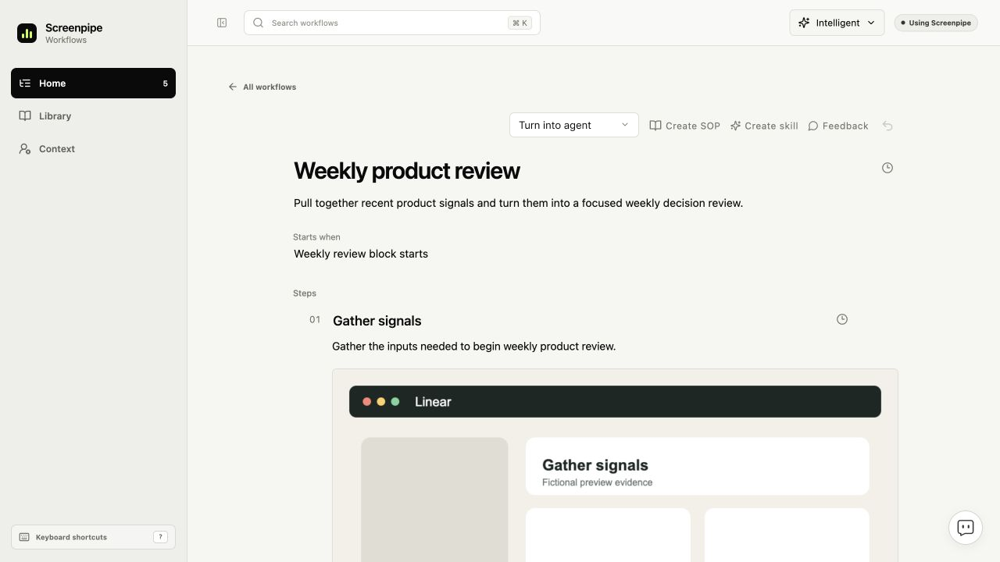
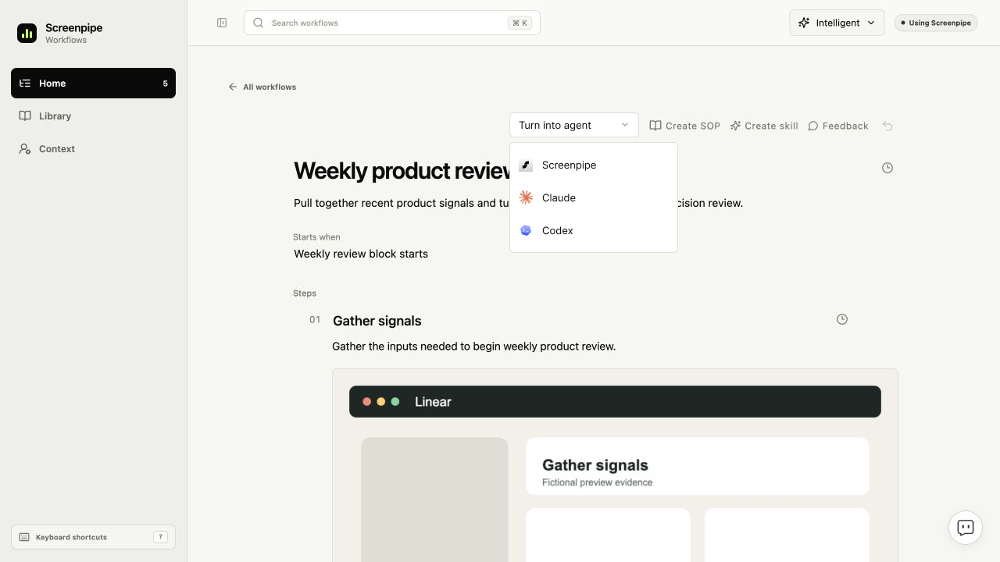

<!-- screenpipe — AI that knows everything you've seen, said, or heard -->
<!-- https://screenpipe.com -->

# Turn into agent: focused UI proposal

<!-- doc-covers: packages/workflows-ui/src, apps/screenpipe-app-tauri/components/workflows/integrated-workflows.tsx, apps/screenpipe-app-tauri/components/chat/home-card-agent-actions.tsx -->
<!-- doc-verified: 6bb353a863b1d805cc6752fb3f0e1f95a62bec00 -->

**Design proposal, revised October 7, 2026.** Add one contextual action and a
provider picker to the existing workflow or useful chat result. Home, Context,
Library, navigation, workflow content and existing controls retain their current
layout. This PR changes documentation and design assets only.

[Revised Figma file](https://www.figma.com/design/kQbZmiUwApaPTaKjPXuhzy)

## Interaction

1. The agent can offer **Turn into agent** when a workflow or useful answer
   describes repeatable work. The user can also invoke the workflow action.
2. The compact menu offers **Screenpipe**, **Claude**, and **Codex**, with the
   existing app provider icons.
3. Continue through the chosen provider's existing setup or handoff controls.
   Prefill the relevant workflow or answer for review. Keep existing Create SOP,
   Create skill, feedback and editing actions.
4. Opening a provider is a handoff, not proof that an agent or schedule exists.
   Scheduling stays with the provider and its existing automation controls.

The suggestion must have a typed payload, rather than interpreting arbitrary
answer text as an executable action. It must not overload authentication or
permission-request blocks. Source content cannot grant new permissions.

## Visual evidence

The unchanged screenshots below come from the maintained browser preview at
`6bb353a863b1d805cc6752fb3f0e1f95a62bec00`, using fictional fixtures and a
1280×720 viewport. They show real shared UI components, not the installed desktop
app. The proposed frames preserve that screenshot as their background and add
editable Figma controls. They are static concepts, not implemented behavior.

### Home: unchanged

Keep the workflow card grid, search, navigation and existing status controls.

### Workflow: before

Keep the existing document, sources and toolbar. This is the comparison baseline.

### Workflow: proposed action

Add the compact action beside the existing toolbar controls without moving them.

### Workflow: provider menu open

The menu overlays the document; it does not reorganize the page.

### Context: unchanged

Keep Company website, Add files or ZIP, Fill context and the existing work-profile
fields. No source dashboard or digital-clone panel is introduced.

## Shared chat context is a separate capability

The original idea of reusing supported local chat context remains an architecture
question. It does not require a new Home layout, Context dashboard, Library tab
or agent-setup screen in this proposal. A shared incremental reader could feed
scoped retrieval and digital-clone synthesis, instead of every workflow scanning
all chats independently. Supported formats, inclusion controls and retention
must be established before implementation. Installed-app discovery alone is not
permission to read a source. Personal chats are not implicitly shared with an
enterprise workspace.

## Implementation acceptance

Reuse the existing `workflowAgentActions` slot and provider handoff adapters.
Keep shared UI portable through platform adapters. Reuse existing setup and
automation controls. Check keyboard focus, menu dismissal, absent providers,
retry behavior and truthful handoff states. Capture actual implemented states
before claiming runtime completion. The same compact action can appear beside a
relevant chat result without changing the chat layout.

The five images cover the unchanged Home and Context and the workflow action's
closed/open states. They do not establish working execution, scheduling or chat
indexing. No new CI jobs, runtime changes or consumer package pins are needed for
this design-only PR.
