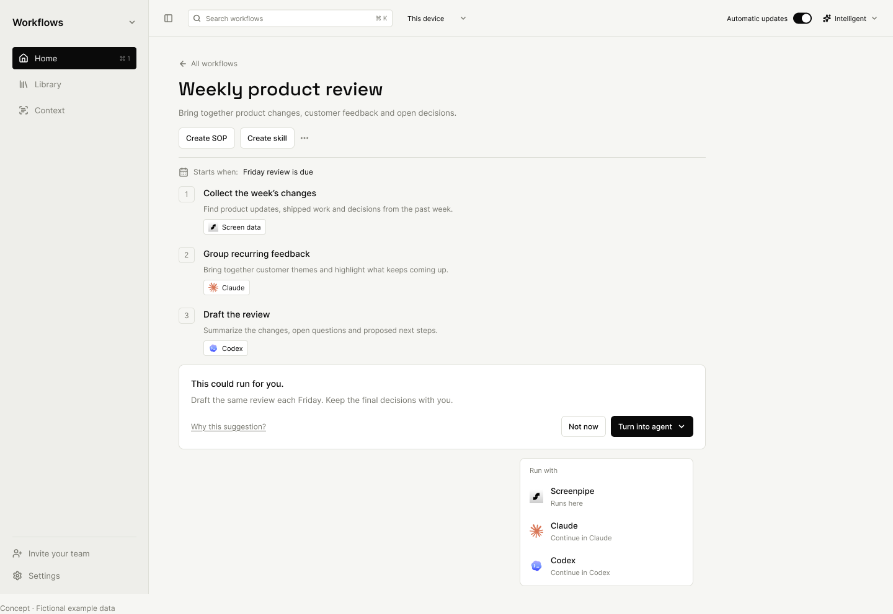
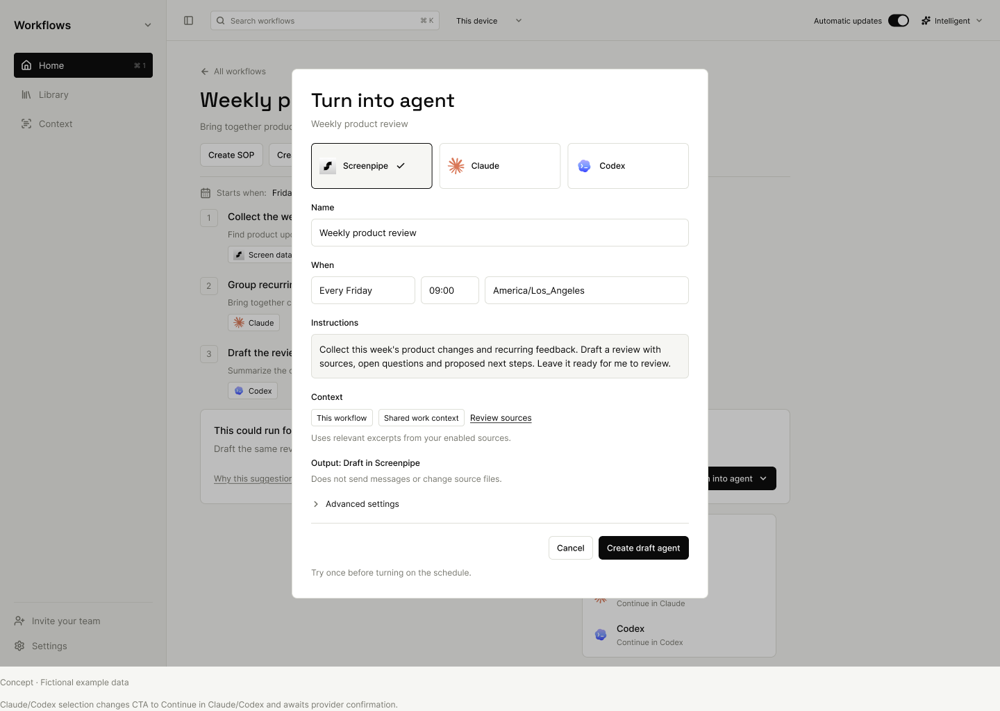
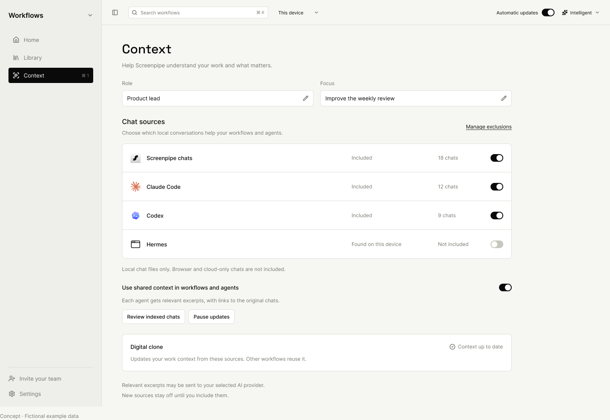
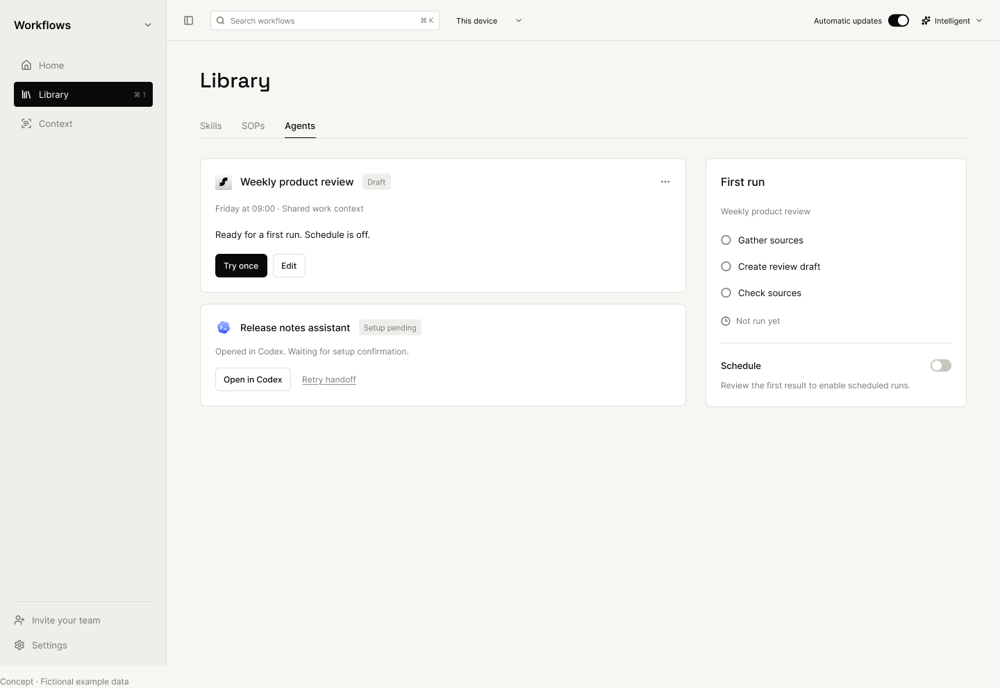
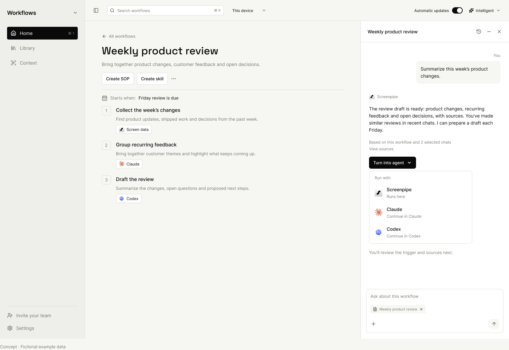

<!-- screenpipe — AI that knows everything you've seen, said, or heard -->
<!-- https://screenpipe.com -->

# Turn a workflow into an agent

<!-- doc-covers: packages/workflows-ui/src, apps/screenpipe-app-tauri/components/workflows/integrated-workflows.tsx, apps/screenpipe-app-tauri/components/chat/home-card-agent-actions.tsx, apps/screenpipe-app-tauri/src-tauri/src/provider_automations.rs -->
<!-- doc-verified: 6bb353a863b1d805cc6752fb3f0e1f95a62bec00 -->

**Design proposal, October 7, 2026.** This document and the five static Figma
exports describe proposed behavior. They do not implement agents, schedules,
chat readers, or an interactive prototype. All names, counts and results in the
images are fictional.

[Editable Figma designs](https://www.figma.com/design/kQbZmiUwApaPTaKjPXuhzy)

## Problem and flow

A useful workflow or chat answer can be the starting point for repeatable work.
The existing desktop workflow surface already offers agent handoff through
`workflowAgentActions` and `HomeCardAgentActions`. This proposal adds a reviewed
agent draft with a trigger, output and source scope to that path.

```text
Useful workflow or chat result
  → Turn into agent
  → Screenpipe / Claude / Codex
  → Review task, trigger, output and context
  → Draft and try once
  → Enable supported scheduling after review
```

Keep Home, Library and Context navigation. Put the suggestion beside the result,
drafts in Library, and shared source controls in Context. Keep Create skill for
portable instructions that do not need a scheduled job. Reuse the compact icons
and labels from the main app's Automations area.

Show a suggestion only when the agent can identify a repeatable task, a useful
output and a plausible trigger. Include the evidence under **Why this
suggestion?** and allow **Not now**. Ask for missing inputs rather than inventing
recurrence or savings. Dismissal persists against the proposal identity.

## Five proposed screens

These are design mockups with fictional data, not running-app screenshots.
Their shell follows the existing Workflows UI; the footer annotations explain
proposed states. Provider marks come from existing app assets.

### 1. Suggestion on a workflow

Keep Create SOP and Create skill. Add the contextual suggestion and the
Screenpipe / Claude / Codex picker next to the workflow it would run.



### 2. Review the agent draft

Edit the task, trigger, time zone, output and context before creating a draft.
The example schedule is a proposal. A draft can remain manual, and creating it
does not activate a schedule.



### 3. Shared chat context

Include supported sources individually, review indexed chats, exclude material,
pause updates and remove indexed material. New sources stay off until included.
Local Claude Code files and browser or cloud Claude chats are different sources.
Hermes being discovered does not imply a supported reader or permission to read.



### 4. Agent drafts in Library

Show Screenpipe drafts with Try once and scheduling off. External handoff stays
Setup pending until the provider confirms creation. Opening an app or copying a
prompt is not confirmation. Retain the provider job ID and link to its controls.



### 5. Suggestion inside the companion chat

Offer the same flow after a useful result, while retaining the surrounding
workflow and the existing companion chat layout.



## Shared context ownership

```text
Included local chat sources
  → Incremental readers and shared local index
      → Digital clone: synthesize preferences and work patterns
      → Workflows and agents: retrieve relevant, scoped excerpts
```

Readers maintain stable conversation/message IDs, cursors, timestamps and source
references. They process changed material once. Reliable ingestion must not
depend on the digital clone happening to run. The digital clone synthesizes
evidence into a compact work profile, keeping observations, inferences and open
questions distinct. Other workflows use the same retrieval service rather than
each scanning transcripts or receiving an unrestricted history copy.

Consumers enforce their own selected source scope at retrieval time. Source
content is untrusted evidence and cannot grant permissions. Distinguish paused,
stale, unsupported and access-required sources from empty ones. Removal stops
future retrieval; retention of earlier outputs needs a separate, explicit policy.

Local storage does not imply local inference. Review must explain that relevant
excerpts may be sent to the selected AI provider. Personal chats are not
implicitly available to an enterprise workspace or another employee.

## Implementation boundaries

| Boundary | Existing path or proposed responsibility |
| --- | --- |
| Workflow entry | Reuse `workflowAgentActions` in the shared UI and `integrated-workflows.tsx`; preserve existing handoff options. |
| Chat suggestion | Introduce a typed proposal payload with task, suggested trigger, source references and allowed destinations. Existing `agent_action` authentication/permission blocks have a different purpose. |
| Draft persistence | Preserve one draft identity across retries, including double-clicks and lost responses. Retain edits on recoverable failure. |
| Provider execution | Extend the existing handoff adapter. Detect supported capabilities and obtain a real creation receipt before claiming an agent exists. |
| Schedule ownership | Follow `provider_automations.rs`: external schedules belong to the provider. Screenpipe projects their state instead of duplicating their scheduler. |
| Shared readers | Add only supported and tested formats. Skill installation paths alone do not prove chat-reader support. |
| Platform boundary | Keep shared UI portable. Native file access and persistence belong in platform adapters. |

Use distinct draft, handed-off, provider-confirmed, running, paused and failed
states. An execution failure must not erase the provider-confirmed identity.
Expose provider limitations where they affect the user's choice, including
whether a particular Claude mode supports unattended scheduling.

## Delivery slices and acceptance

1. **Suggestion and reviewed handoff:** typed suggestion, provider picker,
   editable draft, dismissal, manual trial and truthful pending state. Verify
   keyboard navigation, missing-provider behavior, cancellation, retry identity,
   persistence across restart and the main app's actual Workflows entry path.
2. **Shared context:** implement and test supported readers, scoped retrieval,
   source inclusion, exclusions, pause and removal. Verify deduplication, partial
   writes, corrupt records, file rotation and resume without dropping captures.
3. **Scheduling:** enable only supported adapters after creation receipts and
   manual output review. Verify time zone handling, duplicate prevention,
   cancellation, provider unavailability and recovery without a second scheduler.

Before implementation is considered complete, capture real comparable UI states
with fictional data and run the focused behavior tests. The current exports
cover the proposed desktop light theme only. Narrow layouts, dark theme,
keyboard focus and error states remain implementation acceptance work.

## Review decisions

- Confirm the three-provider picker and placement beside useful results.
- Agree which local chat formats the first reader release supports.
- Choose the retention policy for previously generated outputs after source removal.
- Verify each provider's scheduling capabilities before promising activation.

The proposal reuses the current workflow shell, existing agent handoff and
provider schedule ownership. Merging this document changes no runtime behavior.
