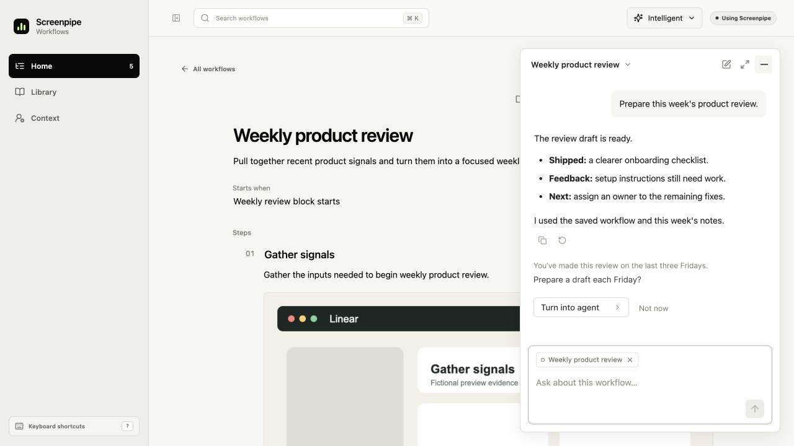
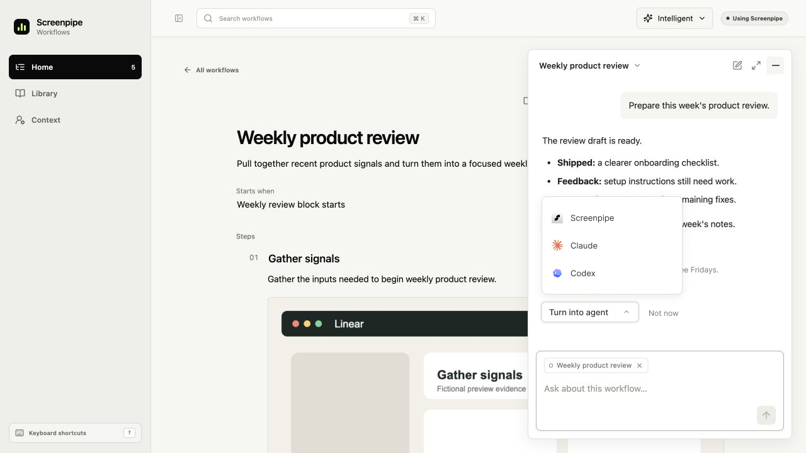

<!-- screenpipe — AI that knows everything you've seen, said, or heard -->
<!-- https://screenpipe.com -->

# Turn into agent: focused UI proposal

<!-- doc-covers: packages/workflows-ui/src, apps/screenpipe-app-tauri/components/workflows/integrated-workflows.tsx, apps/screenpipe-app-tauri/components/chat/home-card-agent-actions.tsx -->
<!-- doc-verified: 6bb353a863b1d805cc6752fb3f0e1f95a62bec00 -->

**Design proposal, revised October 7, 2026.** Offer one contextual action and a
provider picker after a useful chat result. Home, Context,
Library, navigation, workflow content and existing controls retain their current
layout. This PR changes documentation and design assets only.

[Revised Figma file](https://www.figma.com/design/kQbZmiUwApaPTaKjPXuhzy)

## When the agent offers it

This is proposed behavior, not an implemented detector. The agent may propose an
agent after completing a useful answer when it has either an explicit user request
to repeat the task or source-backed evidence of the same task recurring. It must
be able to describe the repeatable task and expected output. A title containing
"weekly" alone is not evidence of repeated work.

For the first version, evaluate at the end of a successful chat turn using the
current task and already-authorized retrieved context. Do not scan every chat on
page render. The model returns a typed proposal with a stable task identity,
reason, evidence references, task, output and optional suggested trigger. Runtime
validation checks source scope, valid references, provider capabilities and saved
dismissal/existing-agent state before the UI displays it.

Suppress the offer after a failed or stopped turn, while the user is correcting
the result, when recurrence is speculative, when a matching agent already exists,
or after dismissal for the same task. A later explicit request can reopen it.
Missing recurrence evidence should lead to an ordinary question, not a claim that
the user repeats the task. Do not convert a proposed time into an active schedule.

## Interaction

1. Complete the useful answer in the existing chat.
2. Add a short reason and a quiet **Turn into agent** action below it. The example
   says "You’ve made this review on the last three Fridays" and asks whether to
   prepare a draft each Friday. That history is fictional in the mockup; real
   product copy must be supported by retrievable source references.
3. The **user's click** opens the compact **Screenpipe / Claude / Codex** picker.
   The agent never opens it automatically. Use the existing provider icons. Keep
   the menu inside the chat, opening above the action when space below is limited.
4. **Not now** dismisses the offer for this task. Escape or clicking outside closes
   only the picker. Keyboard focus returns to its action.
5. Continue through the selected provider's existing setup or handoff controls,
   prefilled for review. Opening a provider is not proof that an agent or schedule
   exists. Scheduling remains with the provider's existing controls.

There is no permanent new toolbar button. Home, Context, Library, the workflow
document and its Create SOP / Create skill actions keep their existing layouts.
The new offer has no surrounding card, accent color or dashboard treatment.
Source content remains evidence and cannot grant permissions.

## Visual evidence

Home and Context come from the maintained browser preview at
`6bb353a863b1d805cc6752fb3f0e1f95a62bec00`. The chat baseline renders those same
shared components with a temporary fictional completed conversation, using the
existing floating-chat mode. All captures are 1280×720. These are browser
component previews, not installed-app captures or live agent results. Temporary
capture fixtures are excluded from the patch.

The proposal preserves the chat screenshot as a locked background and adds
editable Figma controls. It is static and does not implement detection or handoff.

### Before: existing chat after an answer

### Proposed: contextual offer

The offer explains why the work might repeat. It stays below the answer and
leaves the workflow toolbar alone.

### Proposed: picker after a click

The menu opens upward within the chat and leaves the workflow title unobscured.

### Home: unchanged

### Context: unchanged

## Shared chat context is a separate capability

The original idea of reusing supported local chat context remains an architecture
question. It does not require a new Home layout, Context dashboard, Library tab
or agent-setup screen in this proposal. A shared incremental reader could feed
scoped retrieval and digital-clone synthesis, instead of every workflow scanning
all chats independently. Supported formats, inclusion controls and retention
must be established before implementation. Installed-app discovery alone is not
permission to read a source. Personal chats are not implicitly shared with an
enterprise workspace.

## Implementation acceptance

Introduce a typed proposal in the existing assistant renderer and reuse provider
handoff adapters. Keep shared UI portable through platform adapters. Test the
positive cases (explicit repeat request and supported recurring task) and negative
cases (one-off, missing evidence, failed answer, correction, dismissed task and
already-created agent). Verify that suggestions do not auto-open the menu or
activate schedules. Check keyboard focus, dismissal, absent providers, retry
identity and truthful handoff states. Capture actual implemented states before
claiming runtime completion.

The five images cover a completed answer, contextual offer, clicked picker, and
unchanged Home and Context. They do not establish working execution, scheduling
or chat indexing. No new CI jobs, runtime changes or consumer package pins are
needed for this design-only PR.
