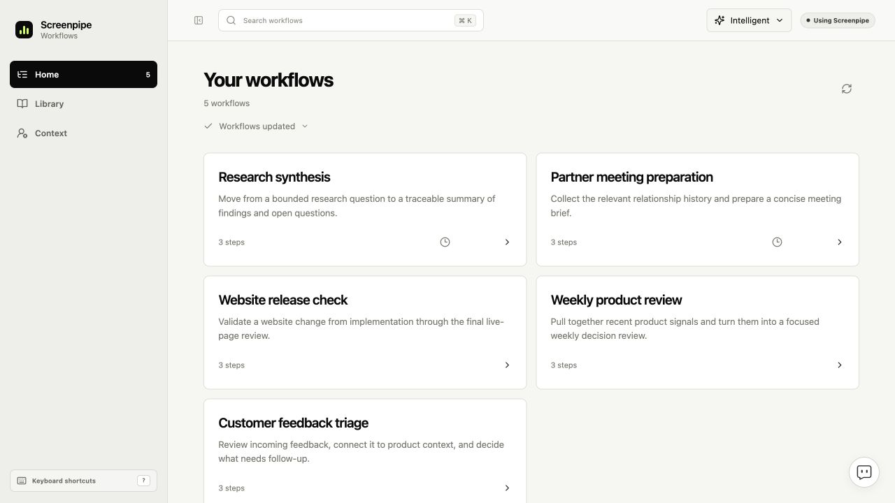
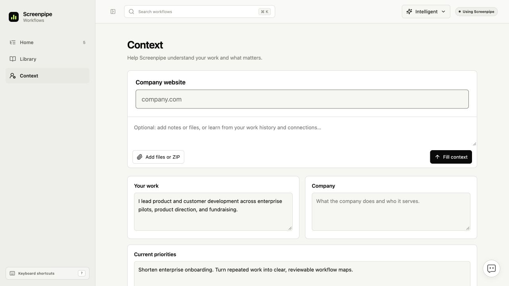

<!-- screenpipe — AI that knows everything you've seen, said, or heard -->
<!-- https://screenpipe.com -->

# Turn a workflow into an agent

<!-- doc-covers: packages/workflows-ui/src, apps/screenpipe-app-tauri/components/workflows/integrated-workflows.tsx, apps/screenpipe-app-tauri/components/chat/home-card-agent-actions.tsx -->
<!-- doc-verified: 6bb353a863b1d805cc6752fb3f0e1f95a62bec00 -->

**Design proposal only. Runtime integration is not implemented.**

A background workflow miner writes a prompt and a boolean on the workflow.
The UI shows a small **Turn into agent** action in the existing toolbar when
that boolean is true. Clicking hands the prompt to the existing agent loop or
creation flow. Provider choice and scheduling stay in that existing flow.

## Minimal contract

Proposed names, not existing runtime fields:

```ts
type WorkflowAgentFields = {
  canAutomate: boolean;
  agentPrompt: string | null;
};
```

`canAutomate` means the miner recommends offering agent creation. It does not
mean a loop is enabled or running. When true, `agentPrompt` must be nonempty.
Old workflows default to false. Keep evidence, source references and user edits
in the workflow's existing fields. There is no separate `agentProposal` object,
proposal status machine or duplicate schedule store.

```text
Background miner reads recordings and supported local chats
  → writes canAutomate + agentPrompt through workflow_workspace
  → existing Review publishes the workflow
  → toolbar shows Turn into agent when canAutomate is true
  → click passes agentPrompt and workflow ID into the existing agent flow
```

The miner uses judgment: is there a useful task an agent can carry out, and can
it write a clear prompt for that task? Put inputs, expected output and any review
step into the prompt. Reuse the workflow's existing evidence for that judgment.
No foreground chat answer or fixed repetition count is required. The existing
Review role checks this along with the workflow; no additional review pipeline.

The integration needs to pass the stored prompt into the existing agent flow;
it is not wired by this documentation PR. The current `workflowAgentTask`
already constructs a handoff prompt from the workflow's title and ID. Extend
that route to use `agentPrompt` rather than inventing another executor. Reuse
existing provider controls and existing loop/schedule ownership. A generated
prompt is not proof that the agent can complete the task successfully.

## UI

Keep **Turn into agent** alongside Create SOP and Create skill, with the same
quiet toolbar styling. It is one action, without a chevron, provider menu,
source-count panel or detached control beside the trigger. Home and Context
retain their existing layouts. A click opens the existing agent flow with the
prompt prefilled; it does not start recurring work merely because the miner
set the boolean.

## Native chat mining still needs wiring

The smaller workflow contract does not make native transcripts available to
scheduled miners. Reuse the existing local Claude Code/Codex readers through a
shared read-only retrieval path that works without the sidebar open. Give the
miners original messages and stable evidence references; extend the existing
publication verifier to resolve those references. Other Pipes and digital clone
can reuse that same source access. Hermes requires its own adapter.

## What exists in the inspected source

| Capability | Current implementation | Gap for this feature |
| --- | --- | --- |
| Background workflow mining | Discover, Deepen, Review and Maintain run as scheduled Pipes. Discover requests hourly coverage. Their prompts and allowed APIs research recorder activity, parsed screen history and meetings. | Native transcript coverage is not configured in these agents. Reading a captured Codex window is not reading its native chat history. |
| Workflow writes | `workflow_workspace` exposes context, propose, handoff and publish, with role restrictions, revisions and durable receipts. Review publishes to the catalog. | Add the boolean and prompt to the existing workflow contract, normalization and UI. |
| Local Claude Code and Codex import | `external-chat-sync.ts` watches `~/.claude/projects` and `~/.codex/sessions`. The desktop chat sidebar starts it. Imports are stored in the Screenpipe chat store. Reconciliation is bounded to seven days and 100 candidates per source. | A UI-mounted importer is not a recorder-independent background mining service or complete historical coverage. |
| Native chat search | `chat-control.ts` provides `search_chats`; core `chat_control.rs` searches Screenpipe, Codex, Claude, Cursor and Gemini CLI chats. | Scheduled Pipe setup does not install this chat-control extension. Search results are bounded previews, not a full evidence-read contract. |
| Background chat leads | The separate skill-learning Pipe can call `/agent/learning/chats`, reusing native discovery for up to five recent, inactive chat results from the last day. | Workflow miners do not allow this route. This lead-only endpoint is insufficient for complete workflow evidence. |
| Hermes | Neither inspected native chat source enum nor the external importer includes Hermes. | A Hermes transcript adapter and fixtures are required. Installing a skill in `.hermes/skills` does not provide chat ingestion. |

Source anchors:

- [Discover prompt and permissions](../crates/screenpipe-core/assets/pipes/workflow-discover/pipe.md)
- [Workflow write tool](../crates/screenpipe-core/assets/extensions/workflow-workspace.ts)
- [Scheduled Pipe tool setup](../crates/screenpipe-core/src/pipes/mod.rs)
- [Native chat search](../crates/screenpipe-core/src/agents/chat_control.rs)
- [External chat synchronization](../apps/screenpipe-app-tauri/lib/chat/external-chat-sync.ts)
- [External chat import bounds](../apps/screenpipe-app-tauri/lib/chat/external-chat-import.ts)
- [Skill-learning chat endpoint](../crates/screenpipe-engine/src/agent_skills.rs)
- [Workflow model](../packages/workflows-ui/src/model.ts)
- [Publication and recorder evidence verification](../crates/screenpipe-engine/src/routes/workflow_catalog.rs)

These are repository findings at the verified commit, not an audit of enabled
agents or successful runs on an installed app. Claude here means supported local
Claude Code transcripts; arbitrary Claude web conversations are not covered by
that reader.

## Verification required for implementation

- Publish and reload the two fields through the existing workflow write path;
  reject true with an empty prompt and preserve user-edited instructions.
- A true flag shows the toolbar action; false and legacy records do not.
- Clicking hands the stored prompt and workflow identity into the existing
  agent flow. It does not create a second scheduler or activate a loop itself.
- Mine native transcript evidence with the sidebar closed, including work never
  captured on screen. Report unsupported or unavailable sources accurately.
- Reuse existing scoped checks. No new CI jobs are part of this proposal.

## Visual evidence

[Editable Figma frame](https://www.figma.com/design/kQbZmiUwApaPTaKjPXuhzy?node-id=21-5).
These are static Figma overlays on the existing shared-UI browser preview, with
fictional workflow content. No live agent execution is demonstrated.

### Existing workflow


### Simple action in the existing toolbar


### Existing Home and Context




