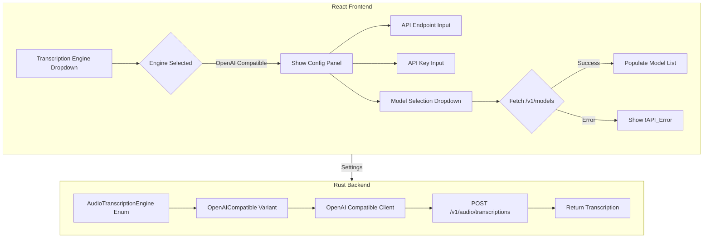

# OpenAI Compatible Transcription Engine Implementation Plan

## Overview

Add support for OpenAI-compatible transcription APIs (e.g., local LLM servers like llama.cpp, ollama, vLLM, etc.) to the screenpipe recording settings. This allows users to use any OpenAI-compatible API endpoint for audio transcription.

## Branch Name
`oAICompat`

## Architecture



## Implementation Details

### 1. Frontend Changes

#### 1.1 Recording Settings Component
**File:** [`apps/screenpipe-app-tauri/components/settings/recording-settings.tsx`](apps/screenpipe-app-tauri/components/settings/recording-settings.tsx)

Add new dropdown option and configuration panel:

```tsx
// Add to transcription engine SelectContent around line 912
<SelectItem value="openai-compatible">OpenAI Compatible</SelectItem>

// Add configuration panel after the deepgram config block around line 933
{settings.audioTranscriptionEngine === "openai-compatible" && (
  <div className="mt-2 ml-[26px] space-y-2">
    {/* API Endpoint Input */}
    <ValidatedInput
      id="openaiCompatibleEndpoint"
      label=""
      value={settings.openaiCompatibleEndpoint || "http://127.0.0.1:8080"}
      onChange={handleOpenAICompatibleEndpointChange}
      placeholder="API Endpoint"
      className="h-7 text-xs"
    />
    
    {/* API Key Input */}
    <div className="relative">
      <ValidatedInput
        id="openaiCompatibleApiKey"
        label=""
        type={showOpenAIApiKey ? "text" : "password"}
        value={settings.openaiCompatibleApiKey || ""}
        onChange={handleOpenAICompatibleApiKeyChange}
        placeholder="API Key (optional)"
        className="pr-8 h-7 text-xs"
      />
      <Button type="button" variant="ghost" size="icon" 
        className="absolute right-0 top-0 h-7 w-7" 
        onClick={() => setShowOpenAIApiKey(!showOpenAIApiKey)}>
        {showOpenAIApiKey ? <EyeOff className="h-3 w-3" /> : <Eye className="h-3 w-3" />}
      </Button>
    </div>
    
    {/* Model Selection */}
    <Select
      value={settings.openaiCompatibleModel || ""}
      onValueChange={(value) => handleSettingsChange({ openaiCompatibleModel: value }, true)}
    >
      <SelectTrigger className="w-full h-7 text-xs">
        <SelectValue placeholder="Select model" />
      </SelectTrigger>
      <SelectContent>
        {openAIModels.map((model) => (
          <SelectItem key={model} value={model}>{model}</SelectItem>
        ))}
      </SelectContent>
    </Select>
  </div>
)}
```

#### 1.2 Settings Types
**File:** [`apps/screenpipe-app-tauri/lib/hooks/use-settings.tsx`](apps/screenpipe-app-tauri/lib/hooks/use-settings.tsx)

Add new settings fields to the Settings type:

```tsx
export type Settings = SettingsStore & {
  // ... existing fields
  openaiCompatibleEndpoint?: string;
  openaiCompatibleApiKey?: string;
  openaiCompatibleModel?: string;
}
```

#### 1.3 Model Fetching Hook
Create a new hook or add to existing component to fetch models from the API:

```tsx
// Add state for models
const [openAIModels, setOpenAIModels] = useState<string[]>([]);
const [isLoadingModels, setIsLoadingModels] = useState(false);

// Function to fetch models
const fetchOpenAIModels = useCallback(async (endpoint: string, apiKey?: string) => {
  setIsLoadingModels(true);
  try {
    const headers: Record<string, string> = {
      'Content-Type': 'application/json',
    };
    if (apiKey) {
      headers['Authorization'] = `Bearer ${apiKey}`;
    }
    
    const response = await fetch(`${endpoint}/v1/models`, {
      method: 'GET',
      headers,
    });
    
    if (!response.ok) {
      throw new Error('Failed to fetch models');
    }
    
    const data = await response.json();
    const models = data.data?.map((m: any) => m.id) || [];
    setOpenAIModels(models);
  } catch (error) {
    console.error('Failed to fetch OpenAI models:', error);
    setOpenAIModels(['!API_Error']);
  } finally {
    setIsLoadingModels(false);
  }
}, []);

// Fetch models when endpoint changes
useEffect(() => {
  if (settings.audioTranscriptionEngine === 'openai-compatible' && settings.openaiCompatibleEndpoint) {
    fetchOpenAIModels(settings.openaiCompatibleEndpoint, settings.openaiCompatibleApiKey);
  }
}, [settings.audioTranscriptionEngine, settings.openaiCompatibleEndpoint, settings.openaiCompatibleApiKey, fetchOpenAIModels]);
```

### 2. Backend Changes

#### 2.1 Audio Transcription Engine Enum
**File:** [`crates/screenpipe-audio/src/core/engine.rs`](crates/screenpipe-audio/src/core/engine.rs)

Add new variant:

```rust
#[derive(Clone, Debug, PartialEq, Default)]
pub enum AudioTranscriptionEngine {
    Deepgram,
    WhisperTiny,
    WhisperTinyQuantized,
    #[default]
    WhisperLargeV3Turbo,
    WhisperLargeV3TurboQuantized,
    WhisperLargeV3,
    WhisperLargeV3Quantized,
    OpenAICompatible,  // NEW
}

impl fmt::Display for AudioTranscriptionEngine {
    fn fmt(&self, f: &mut fmt::Formatter<'_>) -> fmt::Result {
        match self {
            // ... existing matches
            AudioTranscriptionEngine::OpenAICompatible => write!(f, "OpenAICompatible"),
        }
    }
}
```

#### 2.2 CLI Enum
**File:** [`crates/screenpipe-server/src/cli.rs`](crates/screenpipe-server/src/cli.rs)

Add CLI support:

```rust
#[derive(Clone, Debug, ValueEnum, PartialEq)]
pub enum CliAudioTranscriptionEngine {
    // ... existing variants
    #[clap(name = "openai-compatible")]
    OpenAICompatible,
}

impl From<CliAudioTranscriptionEngine> for CoreAudioTranscriptionEngine {
    fn from(cli_engine: CliAudioTranscriptionEngine) -> Self {
        match cli_engine {
            // ... existing matches
            CliAudioTranscriptionEngine::OpenAICompatible => CoreAudioTranscriptionEngine::OpenAICompatible,
        }
    }
}
```

#### 2.3 Settings Store
**File:** [`apps/screenpipe-app-tauri/src-tauri/src/store.rs`](apps/screenpipe-app-tauri/src-tauri/src/store.rs)

Add new fields:

```rust
pub struct SettingsStore {
    // ... existing fields
    
    #[serde(rename = "openaiCompatibleEndpoint")]
    pub openai_compatible_endpoint: Option<String>,
    
    #[serde(rename = "openaiCompatibleApiKey")]
    pub openai_compatible_api_key: Option<String>,
    
    #[serde(rename = "openaiCompatibleModel")]
    pub openai_compatible_model: Option<String>,
}
```

#### 2.4 OpenAI Compatible Transcription Client
**File:** `crates/screenpipe-audio/src/transcription/openai_compatible/mod.rs` (NEW)

```rust
pub mod batch;

use lazy_static::lazy_static;
use std::env;

lazy_static! {
    pub(crate) static ref OPENAI_COMPATIBLE_API_URL: String = env::var("OPENAI_COMPATIBLE_API_URL")
        .unwrap_or_else(|_| "http://127.0.0.1:8080".to_string());
}
```

**File:** `crates/screenpipe-audio/src/transcription/openai_compatible/batch.rs` (NEW)

```rust
use anyhow::Result;
use hound::{WavSpec, WavWriter};
use reqwest::{Client, Response};
use screenpipe_core::Language;
use serde_json::Value;
use std::io::Cursor;
use tracing::{debug, error, info};

pub async fn transcribe_with_openai_compatible(
    endpoint: &str,
    api_key: Option<&str>,
    model: &str,
    audio_data: &[f32],
    device: &str,
    sample_rate: u32,
    languages: Vec<Language>,
) -> Result<String> {
    debug!("starting openai compatible transcription");
    
    // Create a WAV file in memory
    let wav_data = create_wav_file(audio_data, sample_rate)?;
    
    // Build multipart form
    let client = Client::new();
    let mut request = client
        .post(format!("{}/v1/audio/transcriptions", endpoint))
        .multipart(
            reqwest::multipart::Form::new()
                .text("model", model.to_string())
                .part("file", reqwest::multipart::Part::bytes(wav_data)
                    .file_name("audio.wav")
                    .mime_str("audio/wav")?)
        );
    
    if let Some(key) = api_key {
        request = request.bearer_auth(key);
    }
    
    let response = request.send().await?;
    
    handle_response(response, device).await
}

fn create_wav_file(audio_data: &[f32], sample_rate: u32) -> Result<Vec<u8>> {
    let mut cursor = Cursor::new(Vec::new());
    {
        let spec = WavSpec {
            channels: 1,
            sample_rate,
            bits_per_sample: 32,
            sample_format: hound::SampleFormat::Float,
        };
        let mut writer = WavWriter::new(&mut cursor, spec)?;
        for &sample in audio_data {
            writer.write_sample(sample)?;
        }
        writer.finalize()?;
    }
    Ok(cursor.into_inner())
}

async fn handle_response(response: Response, device: &str) -> Result<String> {
    match response.json::<Value>().await {
        Ok(result) => {
            if let Some(error) = result.get("error") {
                error!("OpenAI compatible API error: {:?}", error);
                return Err(anyhow::anyhow!("API error: {:?}", error));
            }
            
            let transcription = result["text"]
                .as_str()
                .unwrap_or("");
            
            if transcription.is_empty() {
                info!("device: {}, transcription is empty.", device);
            } else {
                info!(
                    "device: {}, transcription successful. length: {} characters",
                    device,
                    transcription.len()
                );
            }
            
            Ok(transcription.to_string())
        }
        Err(e) => {
            error!("Failed to parse JSON response: {:?}", e);
            Err(anyhow::anyhow!("Failed to parse JSON response: {:?}", e))
        }
    }
}
```

#### 2.5 STT Integration
**File:** [`crates/screenpipe-audio/src/transcription/stt.rs`](crates/screenpipe-audio/src/transcription/stt.rs)

Add OpenAI Compatible handling:

```rust
use crate::transcription::openai_compatible::batch::transcribe_with_openai_compatible;

pub async fn transcribe(
    audio: &[f32],
    sample_rate: u32,
    device: &str,
    audio_transcription_engine: Arc<AudioTranscriptionEngine>,
    deepgram_api_key: Option<String>,
    openai_compatible_endpoint: Option<String>,  // NEW
    openai_compatible_api_key: Option<String>,   // NEW
    openai_compatible_model: Option<String>,     // NEW
    languages: Vec<Language>,
) -> Result<String> {
    let transcription: Result<String> = match audio_transcription_engine.as_ref() {
        AudioTranscriptionEngine::Deepgram => {
            // ... existing deepgram code
        }
        AudioTranscriptionEngine::OpenAICompatible => {
            let endpoint = openai_compatible_endpoint
                .unwrap_or_else(|| "http://127.0.0.1:8080".to_string());
            let model = openai_compatible_model
                .unwrap_or_else(|| "whisper-1".to_string());
            
            transcribe_with_openai_compatible(
                &endpoint,
                openai_compatible_api_key.as_deref(),
                &model,
                audio,
                device,
                sample_rate,
                languages.clone(),
            ).await
        }
        _ => {
            // ... existing whisper code
        }
    };
    
    transcription
}
```

#### 2.6 Embedded Server Integration
**File:** [`apps/screenpipe-app-tauri/src-tauri/src/embedded_server.rs`](apps/screenpipe-app-tauri/src-tauri/src/embedded_server.rs)

Update the transcription engine mapping:

```rust
.transcription_engine(match config.audio_transcription_engine.as_str() {
    "deepgram" | "screenpipe-cloud" => AudioTranscriptionEngine::Deepgram,
    "openai-compatible" => AudioTranscriptionEngine::OpenAICompatible,  // NEW
    _ => AudioTranscriptionEngine::WhisperLargeV3Turbo,
})
```

Pass OpenAI Compatible settings to the audio manager builder.

### 3. Files to Modify

| File | Changes |
|------|---------|
| `apps/screenpipe-app-tauri/components/settings/recording-settings.tsx` | Add UI for OpenAI Compatible config |
| `apps/screenpipe-app-tauri/lib/hooks/use-settings.tsx` | Add new settings types |
| `apps/screenpipe-app-tauri/src-tauri/src/store.rs` | Add new settings fields |
| `crates/screenpipe-audio/src/core/engine.rs` | Add OpenAICompatible enum variant |
| `crates/screenpipe-audio/src/transcription/mod.rs` | Export openai_compatible module |
| `crates/screenpipe-audio/src/transcription/stt.rs` | Add OpenAI Compatible transcription logic |
| `crates/screenpipe-server/src/cli.rs` | Add CLI enum variant |
| `apps/screenpipe-app-tauri/src-tauri/src/embedded_server.rs` | Pass settings to audio manager |

### 4. New Files to Create

| File | Purpose |
|------|---------|
| `crates/screenpipe-audio/src/transcription/openai_compatible/mod.rs` | Module definition and constants |
| `crates/screenpipe-audio/src/transcription/openai_compatible/batch.rs` | Transcription implementation |

### 5. Testing Plan

1. **Unit Tests**
   - Test OpenAI Compatible transcription client with mock server
   - Test model fetching with various responses
   - Test error handling for API failures

2. **Integration Tests**
   - Test with local llama.cpp server
   - Test with ollama
   - Test with vLLM
   - Test API key handling

3. **Manual Testing**
   - Verify UI displays correctly
   - Verify settings persist across restarts
   - Verify transcription works with real audio

### 6. API Compatibility Notes

The OpenAI Compatible transcription endpoint should follow the OpenAI Audio Transcriptions API format:

```
POST /v1/audio/transcriptions
Content-Type: multipart/form-data

Parameters:
- file: audio file (required)
- model: model ID (required)
- language: language code (optional)
- response_format: "json" (default)
```

Response:
```json
{
  "text": "transcribed text here"
}
```

### 7. Default Values

| Setting | Default Value |
|---------|---------------|
| Endpoint | `http://127.0.0.1:8080` |
| API Key | Empty (optional) |
| Model | First from /v1/models or "whisper-1" |

### 8. Error Handling

1. **Model Fetch Failure**: Display "!API_Error" in model dropdown
2. **Transcription Failure**: Log error and return empty transcription (consistent with existing behavior)
3. **Connection Failure**: Show user-friendly error message

## Implementation Order

1. Create git branch `oAICompat`
2. Backend: Add enum variant and types
3. Backend: Implement transcription client
4. Backend: Integrate into STT flow
5. Frontend: Add settings types
6. Frontend: Add UI components
7. Frontend: Add model fetching
8. Testing
9. Documentation
