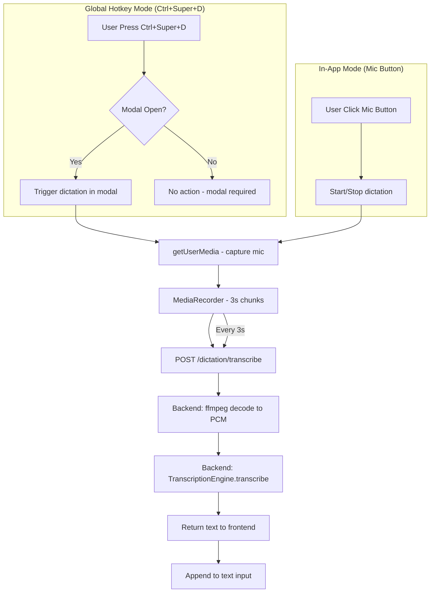

# Voice Dictation Feature Implementation Plan

## Overview
Add voice dictation capability using a **global hotkey** (`Ctrl+Super+D`) that works system-wide, plus in-app microphone buttons for the text input modals. Uses the **user's selected transcription engine** (Deepgram, Whisper, OpenAI-compatible, Qwen3-ASR, screenpipe-cloud) via the unified backend STT pipeline.

## Architecture

## Target Features

### 1. Global Hotkey Dictation (`Ctrl+Super+D`)
- Works when the app is running and a modal is open
- Two behaviors based on context:
  - **When text input is focused in modal**: Append transcribed text to the input
  - **When no text input is focused**: Show floating window with transcribed text (future)

### 2. In-App Mic Buttons
- **"Ask about your screen"** - [`apps/screenpipe-app-tauri/components/standalone-chat.tsx`](apps/screenpipe-app-tauri/components/standalone-chat.tsx)
- **"Search your memory"** - [`apps/screenpipe-app-tauri/components/rewind/search-modal.tsx`](apps/screenpipe-app-tauri/components/rewind/search-modal.tsx)

## Implementation Steps

### Phase 1: MVP - Simple Indicator (COMPLETED ✅)
1. **Create useDictation hook** - Basic hook with transcription state
2. **Add simple indicator UI** - Display "Recording..." indicator when active
3. **Wire up to existing transcription** - Connect to STT engine (placeholder)
4. **Test basic flow** - Verify indicator shows during transcription

### Phase 2: Backend & STT Integration (COMPLETED ✅)
1. **Created dictation endpoint** - `POST /dictation/transcribe` in screenpipe-server
2. **Audio decoding** - `read_audio_from_bytes()` in ffmpeg utils converts any format to f32 PCM
3. **Unified engine pipeline** - Uses `TranscriptionEngine::create_session()` → `TranscriptionSession::transcribe()` supporting all configured engines
4. **Global hotkey handling** - Registered `Ctrl+Super+D` in Rust/Tauri, emits event to frontend
5. **Frontend audio capture** - `getUserMedia` + `MediaRecorder` sends 3-second chunks to backend

### Phase 3: Floating Window UI (COMPLETED ✅)
1. **Created floating dictation component** - `FloatingDictationWindow` overlay at app root
2. **Display transcribed text** - Shows text in real-time as chunks are transcribed
3. **Copy to clipboard button** - Copy transcribed text to system clipboard
4. **Auto-dismiss** - Closes 1.5s after copying or 10s after idle
5. **Text input detection** - Global shortcut routes to modal input if focused, floating window otherwise

### Phase 4: In-App UI Integration (COMPLETED ✅)
1. **Add Mic button to standalone-chat.tsx** - Next to the textarea input
2. **Add Mic button to search-modal.tsx** - Next to the search input
3. **Recording state UI** - Visual feedback (pulsing animation, "Recording..." text)
4. **Error handling** - Show toast on permission denied or transcription errors

## Key Files Modified

### Rust Backend
| File | Change |
|------|--------|
| `apps/screenpipe-app-tauri/src-tauri/src/main.rs` | ✅ Added dictation shortcut registration and event emission |
| `apps/screenpipe-app-tauri/src-tauri/src/store.rs` | ✅ Added dictationShortcut field with platform defaults |
| `crates/screenpipe-server/src/routes/dictation.rs` | ✅ NEW - `POST /dictation/transcribe` endpoint |
| `crates/screenpipe-server/src/routes/mod.rs` | ✅ Added `mod dictation` |
| `crates/screenpipe-server/src/server.rs` | ✅ Registered `/dictation/transcribe` route |
| `crates/screenpipe-audio/src/utils/ffmpeg.rs` | ✅ Added `read_audio_from_bytes()` utility |

### Frontend
| File | Change |
|------|--------|
| `apps/screenpipe-app-tauri/lib/hooks/use-dictation.ts` | ✅ Dictation hook with mic capture + backend STT |
| `apps/screenpipe-app-tauri/components/dictation-indicator.tsx` | ✅ DictationIndicator and DictationButton components |
| `apps/screenpipe-app-tauri/components/standalone-chat.tsx` | ✅ Mic button + onError toast |
| `apps/screenpipe-app-tauri/components/rewind/search-modal.tsx` | ✅ Mic button + onError toast |
| `apps/screenpipe-app-tauri/components/deeplink-handler.tsx` | ✅ Text input detection + event routing |
| `apps/screenpipe-app-tauri/components/dictation-floating-window.tsx` | ✅ NEW - Floating dictation overlay |
| `apps/screenpipe-app-tauri/app/layout.tsx` | ✅ Mounted FloatingDictationWindow |
| `apps/screenpipe-app-tauri/lib/hooks/use-settings.tsx` | ✅ Added dictationShortcut setting |
| `apps/screenpipe-app-tauri/components/settings/shortcut-section.tsx` | ✅ Added dictation shortcut UI row |

## Technical Implementation Details

### Audio Capture & Transcription Flow

1. **Frontend** (`lib/hooks/use-dictation.ts`):
   - `startDictation()` calls `navigator.mediaDevices.getUserMedia({ audio: true })`
   - Creates `MediaRecorder` with browser-supported MIME (WebM/Opus preferred)
   - Collects audio chunks every 3 seconds
   - POSTs raw audio bytes to `http://localhost:3030/dictation/transcribe`
   - Receives `{ "text": "..." }` response and calls `onTranscription` callback
   - Manages state: `idle` → `recording` → `processing` → `idle`

2. **Backend** (`crates/screenpipe-server/src/routes/dictation.rs`):
   - Receives raw audio bytes (any format ffmpeg supports)
   - Decodes to mono f32 PCM @ 16kHz via `read_audio_from_bytes()` (ffmpeg subprocess)
   - Gets `TranscriptionEngine` from `AudioManager::transcription_engine_instance()`
   - Creates `TranscriptionSession` and calls `.transcribe(samples, sample_rate, "dictation")`
   - Dispatches to configured engine: Deepgram, Whisper, OpenAI-compatible, Qwen3-ASR, etc.
   - Returns JSON `{ "text": "transcribed text" }`

3. **Global Shortcut**:
   - Default: `Ctrl+Super+D` (Mac/Linux), `Alt+D` (Windows)
   - Configurable in Settings → Shortcuts
   - Rust `main.rs` registers via Tauri global_shortcut plugin
   - Emits `shortcut-dictation` Tauri event
   - Single listener in `deeplink-handler.tsx` dispatches DOM `toggle-dictation` event
   - `useDictation` hook listens for DOM event to toggle recording

4. **DictationIndicator Component** (`components/dictation-indicator.tsx`):
   - Shows "Recording..." with animated red dot when recording
   - Shows "Processing..." with spinner when processing

5. **DictationButton Component** (`components/dictation-indicator.tsx`):
   - Mic icon button that toggles dictation
   - Red background when recording
   - Includes DictationIndicator

### Key Design Decisions

- **Backend-routed STT** (not direct frontend API calls): All transcription goes through the screenpipe server, which respects the user's configured engine. This means Whisper (local), Deepgram (cloud), OpenAI-compatible (self-hosted), and Qwen3-ASR all work automatically.
- **Chunk-based** (not streaming): Audio is sent in 3-second chunks via HTTP POST rather than WebSocket streaming. This is simpler and works with all engine backends. Could be upgraded to SSE/WebSocket streaming for lower latency in the future.
- **Single event listener**: The Tauri `shortcut-dictation` event is listened for in one place (`deeplink-handler.tsx`) and dispatched as a DOM event, preventing duplicate handlers when multiple `useDictation` instances are mounted.
- **Stabilized refs**: Options callbacks use `useRef` to avoid excessive `useEffect` teardown/setup on every render.

## Implementation Status

### ✅ COMPLETED
1. Created `useDictation` hook with mic capture and backend STT integration
2. Created `DictationIndicator` and `DictationButton` components
3. Added mic button to "Ask about your screen" modal (standalone-chat.tsx)
4. Added mic button to "Search your memory" modal (search-modal.tsx)
5. Recording state visual feedback (pulsing animation, "Recording..." text)
6. Added global shortcut configuration (Ctrl+Super+D / Alt+D)
7. Added shortcut to settings UI
8. Wired up Rust backend to emit shortcut-dictation event
9. Single event listener in deeplink-handler.tsx for global shortcut
10. Created `POST /dictation/transcribe` endpoint in screenpipe-server
11. Added `read_audio_from_bytes()` ffmpeg utility
12. Connected frontend audio capture to backend STT pipeline
13. Error handling with toast notifications
14. Text input detection in deeplink-handler (routes to modal vs floating window)
15. Created `FloatingDictationWindow` component with copy-to-clipboard
16. Mounted floating window at app root (layout.tsx)

### ⏳ PENDING
- Upgrade to SSE/WebSocket streaming for lower latency (currently 3s chunks)
- Handle microphone permission checks gracefully across platforms
- End-to-end testing across all STT engines
- Testing and polish

## Updated Todo List

- [x] Create useDictation hook
- [x] Add DictationIndicator and DictationButton components
- [x] Add microphone button UI to "Ask about your screen" modal
- [x] Add microphone button UI to "Search your memory" modal
- [x] Implement recording state visual feedback
- [x] Add global hotkey handling in Rust/Tauri
- [x] Add global hotkey listener in frontend (single listener pattern)
- [x] Add `POST /dictation/transcribe` endpoint in screenpipe-server
- [x] Add `read_audio_from_bytes()` ffmpeg utility
- [x] Connect frontend mic capture to backend STT pipeline
- [x] Error handling with toast notifications
- [x] Add text input detection logic
- [x] Create floating dictation window component
- [ ] Upgrade to SSE/WebSocket streaming for lower latency
- [ ] Handle permission checks for microphone access
- [ ] Test end-to-end flow with global hotkey
- [ ] Test end-to-end flow with in-app buttons
- [ ] Test with all STT engines (Deepgram, Whisper, OpenAI-compatible, Qwen3-ASR)
