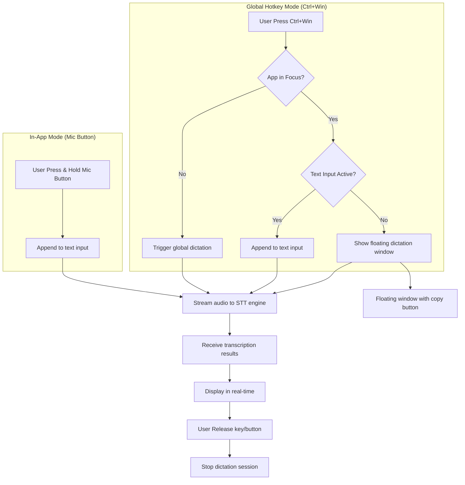

# Voice Dictation Feature Implementation Plan

## Overview
Add voice dictation capability using a **global hotkey** (`Ctrl+Win`) that works system-wide, plus in-app microphone buttons for the text input modals. Uses the **user's selected transcription engine** (Deepgram, Whisper, or OpenAI-compatible).

## Architecture

## Target Features

### 1. Global Hotkey Dictation (`Ctrl+Win`)
- Works system-wide, even when screenpipe is not in focus
- Two behaviors based on context:
  - **When text input is focused**: Append transcribed text to the input
  - **When no text input is focused**: Show floating window with transcribed text and copy button

### 2. In-App Mic Buttons
- **"Ask about your screen"** - [`apps/screenpipe-app-tauri/components/standalone-chat.tsx:2474`](apps/screenpipe-app-tauri/components/standalone-chat.tsx#L2474)
- **"Search your memory"** - [`apps/screenpipe-app-tauri/components/rewind/search-modal.tsx:1346`](apps/screenpipe-app-tauri/components/rewind/search-modal.tsx#L1346)

## Implementation Steps

### Phase 1: MVP - Simple Indicator (Start Here)
1. **Create useDictation hook** - Basic hook with transcription state
2. **Add simple indicator UI** - Display "Recording..." indicator when active
3. **Wire up to existing transcription** - Connect to STT engine
4. **Test basic flow** - Verify indicator shows during transcription

### Phase 2: Backend (Rust)
1. **Explore STT streaming** - Review transcription modules for Deepgram, Whisper, and OpenAI-compatible engines
2. **Create dictation module** - New module for short-lived transcription sessions
3. **Add HTTP endpoints**:
   - POST `/dictation/start` - Start dictation session
   - POST `/dictation/stop` - Stop dictation session
   - GET `/dictation/stream` - SSE stream for real-time results
4. **Add global hotkey handling** - Register system-wide keyboard shortcut in Rust/Tauri
5. **Expose transcription events** - Broadcast transcription results to frontend via events

### Phase 3: Floating Window UI
1. **Create floating dictation component** - New overlay component
2. **Display transcribed text** - Show text in real-time as it's transcribed
3. **Copy to clipboard button** - Copy transcribed text to system clipboard
4. **Auto-dismiss** - Close after copying or after inactivity

### Phase 4: In-App UI Integration
1. **Add Mic button to standalone-chat.tsx** - Next to the textarea input
2. **Add Mic button to search-modal.tsx** - Next to the search input
3. **Recording state UI** - Visual feedback (pulsing animation, "Recording..." text)
4. **Error handling** - Show toast on permission denied or transcription errors

## Key Files to Modify

### Rust Backend
| File | Change |
|------|--------|
| `crates/screenpipe-server/src/routes/mod.rs` | Add dictation routes |
| `crates/screenpipe-server/src/routes/dictation.rs` | NEW - Dictation endpoint implementation |
| `crates/screenpipe-audio/src/audio_manager/manager.rs` | Add dictation session management |
| `crates/screenpipe-server/src/lib.rs` | Register global hotkey handler |

### Frontend
| File | Change |
|------|--------|
| `apps/screenpipe-app-tauri/lib/hooks/use-dictation.ts` | ✅ NEW - Dictation hook (MVP done) |
| `apps/screenpipe-app-tauri/lib/utils/tauri.ts` | Add dictation Tauri commands |
| `apps/screenpipe-app-tauri/components/standalone-chat.tsx` | ✅ Add Mic button |
| `apps/screenpipe-app-tauri/components/rewind/search-modal.tsx` | ✅ Add Mic button |
| `apps/screenpipe-app-tauri/components/dictation-floating-window.tsx` | NEW - Floating window component |

## Technical Considerations

### Audio Capture Strategy
- Reuse existing audio device infrastructure from [`crates/screenpipe-audio/src/audio_manager/manager.rs`](crates/screenpipe-audio/src/audio_manager/manager.rs)
- Start temporary stream from **default input device**
- Design for future device selection capability (don't hardcode device ID)
- Do NOT persist audio to database (dictation only)
- **Keep main audio recording running** during dictation

### Global Hotkey Implementation
- Use Tauri's global shortcut API to register `Ctrl+Win`
- Handle key press and release events
- Broadcast events to frontend when hotkey is triggered

### Real-time Streaming
- Use Server-Sent Events (SSE) for streaming transcription to frontend
- Similar to existing streaming patterns in [`crates/screenpipe-server/src/routes/streaming.rs`](crates/screenpipe-server/src/routes/streaming.rs)
- Send partial results as they arrive from the selected STT engine

### Text Behavior
- **Append** transcribed text to existing input (not replace)
- When not in text input: show floating window with copy button
- Floating window auto-closes after copying or after timeout

### Transcription Engine
- Use whatever transcription engine the user has configured (Deepgram, Whisper, or OpenAI-compatible)
- Respect user settings from [`apps/screenpipe-app-tauri/lib/hooks/use-settings.tsx`](apps/screenpipe-app-tauri/lib/hooks/use-settings.tsx)

## Implementation Status

### ✅ COMPLETED (MVP)
1. Created `useDictation` hook - tracks recording state (idle/recording/processing)
2. Created `DictationIndicator` and `DictationButton` components
3. Added mic button to "Ask about your screen" modal (standalone-chat.tsx)
4. Added mic button to "Search your memory" modal (search-modal.tsx)
5. Simple indicator shows "Recording..." when active

### 🔄 IN PROGRESS
- Connecting useDictation hook to backend STT engine

### ⏳ PENDING
- Backend: Create dictation API endpoints in Rust
- Backend: Add global hotkey (Ctrl+Win) handling
- Backend: SSE streaming for real-time transcription
- Frontend: Create floating window for global hotkey mode
- Frontend: Text input detection
- Testing and polish

## Updated Todo List

- [ ] Explore STT streaming implementations (Deepgram, Whisper, OpenAI-compatible)
- [ ] Design dictation API endpoints in Rust (server-side)
- [ ] Add global hotkey handling in Rust/Tauri
- [ ] Create SSE mechanism to stream transcription results
- [ ] Implement frontend useDictation hook
- [ ] Add text input detection logic
- [ ] Create floating dictation window component
- [ ] Add global hotkey listener in frontend
- [ ] Add microphone button UI to "Ask about your screen" modal
- [ ] Add microphone button UI to "Search your memory" modal
- [ ] Implement recording state visual feedback
- [ ] Handle permission checks for microphone access
- [ ] Test end-to-end flow with global hotkey
- [ ] Test end-to-end flow with in-app buttons
